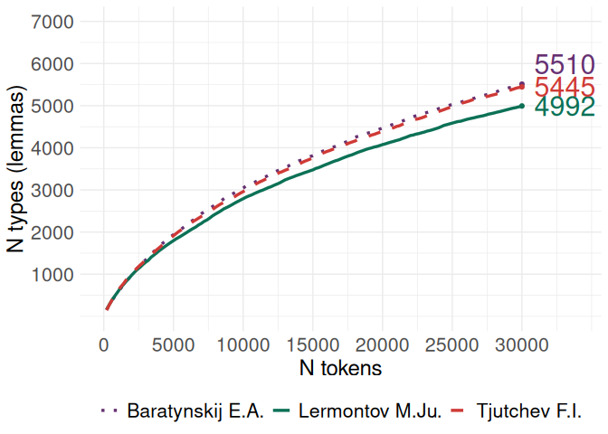
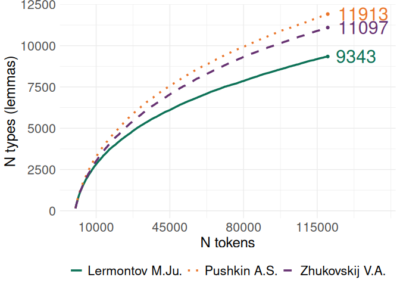
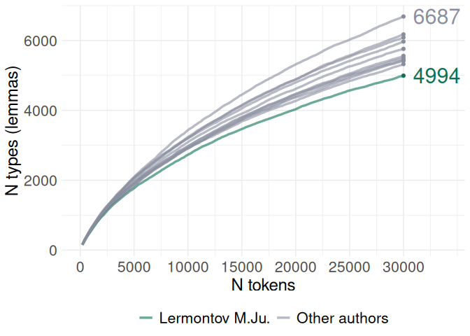
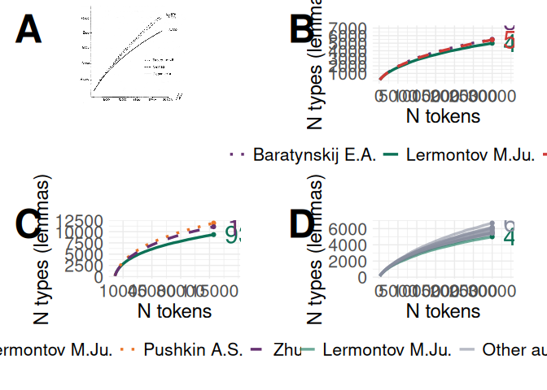
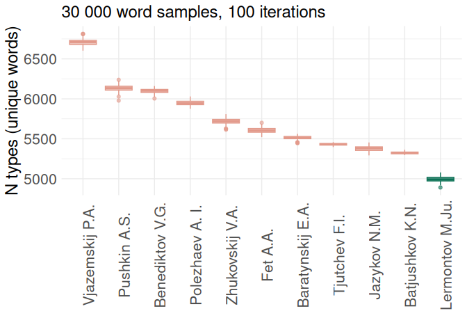
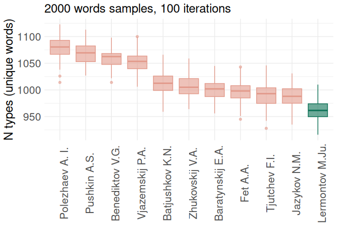
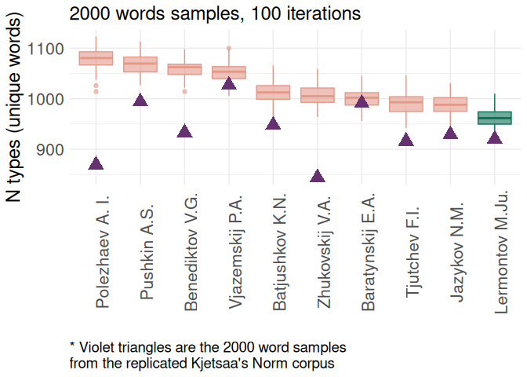
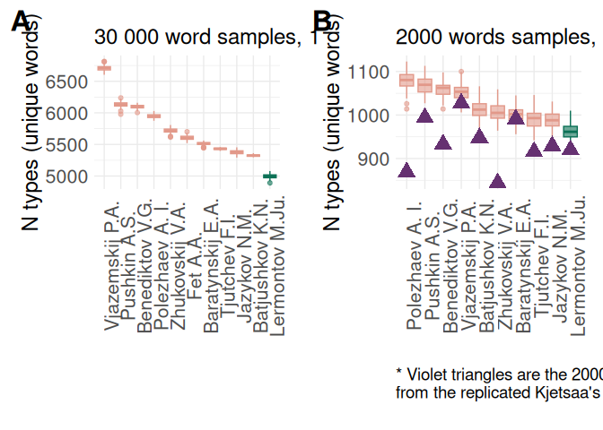

# 01_TTR


## TTR

## Load data & pckg

This notebook replicates Kjetsaa’s plot on TTR in poetic corpora.

``` r
library(dplyr)
library(tidyr)
library(tidytext)

library(ggplot2)
library(MetBrewer)
library(cowplot)
# libs to attach jpeg to plots
library(jpeg)
library(magick)

theme_set(theme_minimal())
```

Load data

    Rows: 1,124,893
    Columns: 11
    $ corpus            <chr> "ru", "ru", "ru", "ru", "ru", "ru", "ru", "ru", "ru"…
    $ id_poem           <int> 33734, 33734, 33734, 33734, 33734, 33734, 33734, 337…
    $ id                <chr> "br1-105", "br1-105", "br1-105", "br1-105", "br1-105…
    $ title             <chr> "К...", "К...", "К...", "К...", "К...", "К...", "К..…
    $ year_created_from <dbl> 1821, 1821, 1821, 1821, 1821, 1821, 1821, 1821, 1821…
    $ year_created_to   <dbl> 1821, 1821, 1821, 1821, 1821, 1821, 1821, 1821, 1821…
    $ id_author         <int> 220, 220, 220, 220, 220, 220, 220, 220, 220, 220, 22…
    $ author            <chr> "Baratynskij E.A.", "Baratynskij E.A.", "Baratynskij…
    $ word              <chr> "приятель", "строгий", "ты", "не", "прав", "несправе…
    $ lemma             <chr> "приятель", "строгий", "ты", "не", "правый", "неспра…
    $ analysis          <chr> "[{'analysis': [{'lex': 'приятель', 'gr': 'S,муж,од=…

## Analysis

Check number of tokens per author

                          author      n
    1            Zhukovskij V.A. 244391
    2               Pushkin A.S. 187847
    3            Lermontov M.Ju. 127548
    4                   Fet A.A.  75923
    5            Vjazemskij P.A.  66264
    6               Jazykov N.M.  58910
    7            Benediktov V.G.  49967
    8            Polezhaev A. I.  44272
    9           Baratynskij E.A.  38958
    10           Batjushkov K.N.  33389
    11             Tjutchev F.I.  33276
    12               Delvig A.A.  27357
    13               Kozlov I.I.  25708
    14               Ryleev K.F.  23804
    15             Homjakov A.S.  22729
    16             Koltsov A. V.  19710
    17          Kjuhelbeker V.K.  14540
    18             Shevyrev S.P.   9983
    19          Venevitinov D.V.   8586
    20               Glinka F.N.   6348
    21 Bestuzhev-Marlinskij A.A.   5383

Create a subset with authors \> 30k tokens

### Fig 1-b: 3 authors replication

Replication of Kjetsaa’s 1973 figure: first prepare samples data (three
authors, 30k sampled tokens, assigned to 150 samples of 200 words).

    # A tibble: 6 × 3
      sample_x author               n
         <int> <chr>            <int>
    1        1 Baratynskij E.A.   200
    2        1 Lermontov M.Ju.    200
    3        1 Tjutchev F.I.      200
    4        2 Baratynskij E.A.   200
    5        2 Lermontov M.Ju.    200
    6        2 Tjutchev F.I.      200

``` r
v <- c(1:samples_number) # vector to count samples

# tibble to store results
df <- tibble(author = NULL, 
             n = NULL)
s <- NULL
x <- NULL

for (i in 1:length(v)) {
  s <- v[1:i] # iterator that takes 1, then 1 2, then 1 2 3, etc.
  
  x <- corpus_sampled %>% 
      filter(author %in% c("Lermontov M.Ju.", 
                           "Tjutchev F.I.", 
                           "Baratynskij E.A.")) %>% 
      filter(sample_x %in% c(s)) %>% 
      select(author, lemma) %>% 
      distinct() %>% 
      ungroup() %>% 
      count(author) %>%  
      # add column with total number of tokens (n_samples * sample size)
      mutate(n_tokens = s[i] * sample_size)
  
  df <- rbind(df, x)
}


# find max number of lemma
max <- df %>% 
  group_by(author) %>% 
  slice_max(n) %>% ungroup() %>% 
  rename(max_lemma = n,
         max_n_tokens = n_tokens)

plot_1 <- df %>% 
  # attach max lemma values for annotation
  # left_join(max, by = "author") %>% 
  ggplot(aes(x = n_tokens, y = n,
         group = author, colour = author)) + 
  #geom_point() + 
  geom_line(aes(lty = author), linewidth = 1.2) + 
  labs(y = "N types (lemmas)", x = "N tokens") + 
  scale_linetype_manual(values = c(3,1,2)) + 
  scale_colour_manual(values = c(met.brewer("Java")[1],
                                 met.brewer("Java")[5],
                                 met.brewer("Java")[2])) + 
  scale_x_continuous(breaks = seq(0, 31000, by = 5000), 
                     limits = c(0, 34000)) + 
  scale_y_continuous(breaks = seq(1000, 7000, by = 1000),
                     limits = c(0, 7000)) + 
  geom_point(data = max, 
             aes(x = max_n_tokens, y = max_lemma, group = author),
             show.legend = FALSE) + 
  geom_text(data = max %>% filter(author != "Baratynskij E.A."), 
            aes(x = max_n_tokens, y = max_lemma, label = max_lemma), 
            hjust = -0.2, size = 8,
            show.legend = FALSE) + 
  geom_text(data = max %>% filter(author == "Baratynskij E.A."),
            aes(x = max_n_tokens, y = max_lemma, label = max_lemma), 
            hjust = -0.2, vjust = -0.5, size = 8, show.legend = FALSE) +
  theme(axis.text = element_text(size = 16),
        axis.title = element_text(size = 18),
        legend.text = element_text(size = 16),
        legend.position = "bottom",
        legend.title = element_blank())

plot_1
```



``` r
# ggsave("../plots/01_ttr_3-authors.png", plot = last_plot(),
#        width = 6.5, height = 6, bg = "white", dpi = 300)
```

### Fig 1-c: largest authorial corpora

Select authors with the biggest corpora & find when the TTR growth stops

Draw curves & find max



### Fig 1-d: 11 authors

Draw curves for 11 authors with corpus size \>30k



### Merge Fig 1

Merge new plots to the Kjetsaa’s one



## Fig 2: TTR boxplots

### Fig 2-a: 30k authors

Iterative calculation of TTR for 10 authors with 30k tokens

``` r
i <- NULL
df <- NULL

# 100 iterations
for (i in 1:100) {
  corpus_smpl <- corpus %>% 
    filter(author %in% authors_30k) %>% 
    group_by(author) %>% 
    # sample random 10k words
    sample_n(30000) %>% 
    count(lemma) %>% 
    ungroup() %>% 
    count(author)

  df <- rbind(df, corpus_smpl)
}

glimpse(df)
```

    Rows: 1,100
    Columns: 2
    $ author <chr> "Baratynskij E.A.", "Batjushkov K.N.", "Benediktov V.G.", "Fet …
    $ n      <int> 5472, 5304, 6121, 5606, 5435, 5023, 5974, 6099, 5433, 6708, 570…

``` r
plot_2a <- df %>% 
  mutate(author_is = ifelse(author == "Lermontov M.Ju.", "Lermontov M.Ju.", "Others")) %>% 
  ggplot(aes(x = reorder(author, -n, mean), y = n)) + 
  geom_boxplot(aes(fill = author_is, colour = author_is), alpha = 0.6) + 
  labs(x = "", 
       y = "N types (unique words)",
       fill = "", colour = "",
       subtitle = "30 000 word samples, 100 iterations") + 
  scale_fill_manual(values = c(met.brewer("Java")[5],
                               met.brewer("Java")[4])) + 
  scale_colour_manual(values = c(met.brewer("Java")[5],
                               met.brewer("Java")[4])) + 
  theme(
    axis.text = element_text(size = 16),
    axis.text.x = element_text(angle = 90),
    axis.title = element_text(size = 18),
    legend.text = element_text(size = 16),
    plot.subtitle = element_text(size = 18),
    legend.position = "None"
  )

plot_2a
```



``` r
# ggsave("../plots/00_ttr_30ksamples.png", plot = last_plot(),
#        dpi = 300, bg = "white",
#        width = 9, height = 7)
```

### 2k samples

``` r
i <- NULL
df_2k <- NULL

# 100 iterations
for (i in 1:100) {
  corpus_smpl <- corpus %>% 
    filter(author %in% authors_30k) %>% 
    group_by(author) %>% 
    # sample random 2k words
    sample_n(2000) %>% 
    count(lemma) %>% 
    ungroup() %>% 
    count(author)

  df_2k <- rbind(df_2k, corpus_smpl)
}

glimpse(df_2k)
```

    Rows: 1,100
    Columns: 2
    $ author <chr> "Baratynskij E.A.", "Batjushkov K.N.", "Benediktov V.G.", "Fet …
    $ n      <int> 1015, 1031, 1062, 998, 990, 956, 1086, 1085, 984, 1037, 1040, 1…

``` r
plot_2b <- df_2k %>% 
  mutate(author_is = ifelse(author == "Lermontov M.Ju.", "Lermontov M.Ju.", "Others")) %>% 
  ggplot(aes(x = reorder(author, -n, mean), y = n)) + 
  geom_boxplot(aes(fill = author_is, colour = author_is), alpha = 0.6) + 
  labs(x = "", 
       y = "N types (unique words)",
       fill = "", colour = "",
       subtitle = "2000 words samples, 100 iterations") + 
  scale_fill_manual(values = c(met.brewer("Java")[5],
                               met.brewer("Java")[4])) + 
  scale_colour_manual(values = c(met.brewer("Java")[5],
                               met.brewer("Java")[4])) + 
  theme(
    axis.text = element_text(size = 16),
    axis.text.x = element_text(angle = 90),
    axis.title = element_text(size = 18),
    legend.text = element_text(size = 16),
    plot.subtitle = element_text(size = 18),
    legend.position = "None"
  )

plot_2b
```



``` r
# ggsave("../plots/00_ttr_2ksamples.png", plot = last_plot(), 
#        dpi = 300, bg = "white", 
#        width = 9, height = 7)
```

TTR in Kjetsaa’s norm: read lemmatized corpus, calculate N tokens per
author

                     author_name    n
    1               Pushkin A.S. 4300
    2                Kozlov I.I. 2628
    3            Polezhaev A. I. 2342
    4              Homjakov A.S. 2325
    5            Vjazemskij P.A. 2232
    6                Glinka F.N. 2182
    7               Jazykov N.M. 2159
    8           Kjuhelbeker V.K. 2159
    9           Venevitinov D.V. 2152
    10 Bestuzhev-Marlinskij A.A. 2108
    11           Benediktov V.G. 2105
    12             Koltsov A. V. 2101
    13           Zhukovskij V.A. 2089
    14               Delvig A.A. 2058
    15           Lermontov M.Ju. 2040
    16               Ryleev K.F. 2008
    17             Shevyrev S.P. 1980
    18          Baratynskij E.A. 1945
    19             Tjutchev F.I. 1853
    20           Batjushkov K.N. 1836

Count N lemmas in Kjetsaa’s corpus

    # A tibble: 20 × 2
       author                    n_kjetsaa
       <chr>                         <int>
     1 Baratynskij E.A.                991
     2 Batjushkov K.N.                 948
     3 Benediktov V.G.                 933
     4 Bestuzhev-Marlinskij A.A.      1019
     5 Delvig A.A.                     823
     6 Glinka F.N.                     913
     7 Homjakov A.S.                   858
     8 Jazykov N.M.                    929
     9 Kjuhelbeker V.K.                915
    10 Koltsov A. V.                   904
    11 Kozlov I.I.                     782
    12 Lermontov M.Ju.                 920
    13 Polezhaev A. I.                 869
    14 Pushkin A.S.                    994
    15 Ryleev K.F.                     902
    16 Shevyrev S.P.                   911
    17 Tjutchev F.I.                   916
    18 Venevitinov D.V.                908
    19 Vjazemskij P.A.                1027
    20 Zhukovskij V.A.                 844

### Fig 2-b



### Merge Fig 2

``` r
plot_grid(plot_2a, plot_2b, align = "h", nrow = 1, 
          labels = c('A', 'B'), scale = 0.9, label_size = 24)
```



``` r
# ggsave("../plots/fig_2.png", plot = last_plot(),
#        dpi = 300, bg = "white",
#        width = 12, height = 7)
```
