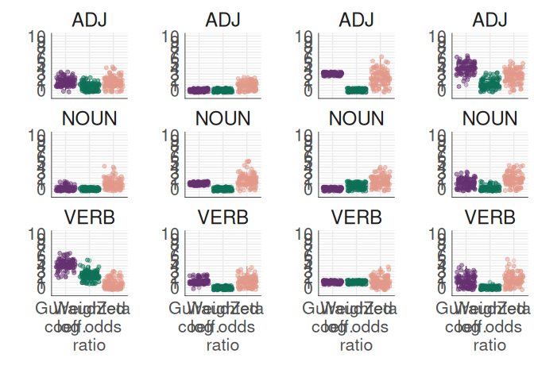
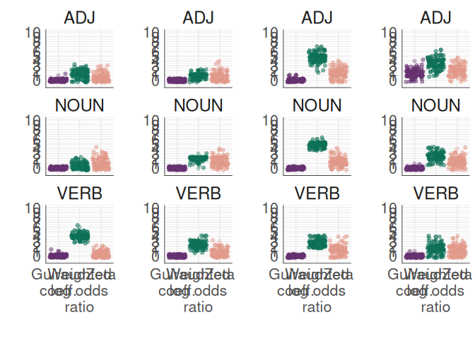
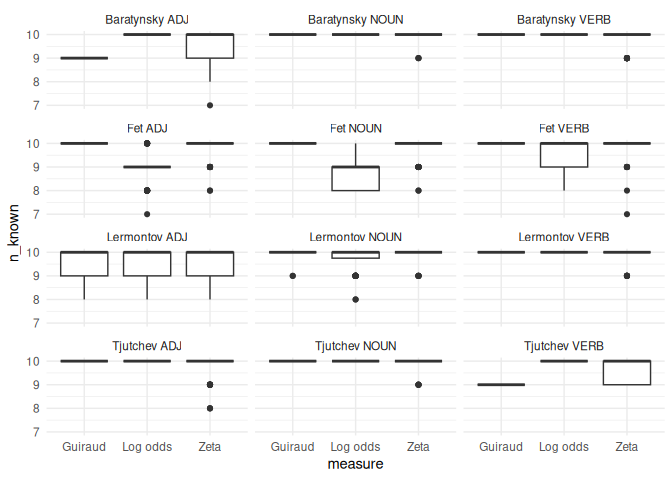
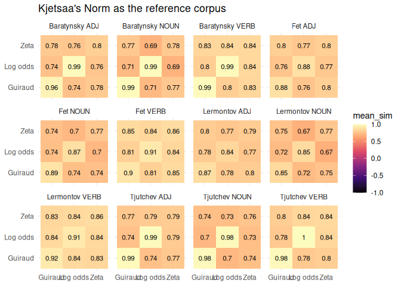
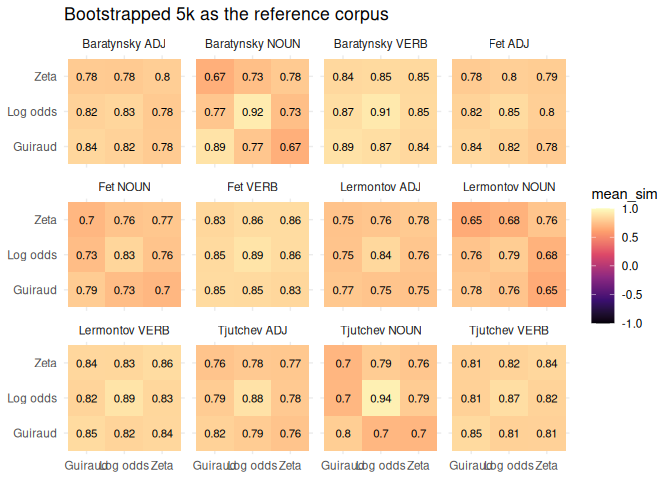
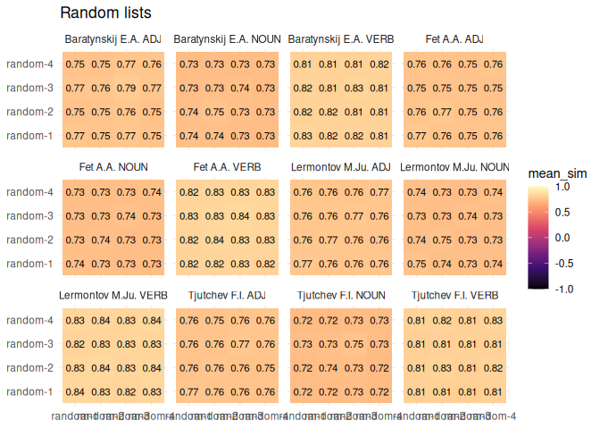

# 02_keywords


## Keywords analysis

## Load data & pckg

Load data

    Rows: 1,124,893
    Columns: 12
    $ corpus            <chr> "ru", "ru", "ru", "ru", "ru", "ru", "ru", "ru", "ru"~
    $ id_poem           <int> 33734, 33734, 33734, 33734, 33734, 33734, 33734, 337~
    $ id                <chr> "br1-105", "br1-105", "br1-105", "br1-105", "br1-105~
    $ title             <chr> "\320\232...", "\320\232...", "\320\232...", "\320\2~
    $ year_created_from <dbl> 1821, 1821, 1821, 1821, 1821, 1821, 1821, 1821, 1821~
    $ year_created_to   <dbl> 1821, 1821, 1821, 1821, 1821, 1821, 1821, 1821, 1821~
    $ id_author         <int> 220, 220, 220, 220, 220, 220, 220, 220, 220, 220, 22~
    $ author_name       <chr> "Baratynskij E.A.", "Baratynskij E.A.", "Baratynskij~
    $ word              <chr> "\320\277\321\200\320\270\321\217\321\202\320\265\32~
    $ lemma             <chr> "\320\277\321\200\320\270\321\217\321\202\320\265\32~
    $ analysis          <chr> "[{'analysis': [{'lex': '\320\277\321\200\320\270\32~
    $ pos               <chr> "S", "A", "SPRO", "PART", "A", "A", "S", "A", "S", "~

Load Kjetsaa’s norm corpus replication:

    Rows: 44,602
    Columns: 6
    $ id_poem     <dbl> 12083, 12083, 12083, 12083, 12083, 12083, 12083, 12083, 12~
    $ author_name <chr> "Pushkin A.S.", "Pushkin A.S.", "Pushkin A.S.", "Pushkin A~
    $ title       <chr> "\320\240\320\276\320\267\320\260 : \302\253\320\223\320\2~
    $ lemma       <chr> "\320\263\320\264\320\265", "\320\275\320\260\321\210", "\~
    $ pos         <chr> "ADVPRO", "APRO", "S", "S", "APRO", "V", "S", "S", "S", "P~
    $ corpus      <chr> "norm", "norm", "norm", "norm", "norm", "norm", "norm", "n~

### overview

Number of poems by 4 authors

           author_name   n
    1         Fet A.A. 920
    2  Lermontov M.Ju. 473
    3    Tjutchev F.I. 385
    4 Baratynskij E.A. 245

Number of words / lemmas

    # A tibble: 4 x 3
      author_name      n_words n_lemmas
      <chr>              <int>    <int>
    1 Baratynskij E.A.   38958     6288
    2 Fet A.A.           75923     8870
    3 Lermontov M.Ju.   127548     9570
    4 Tjutchev F.I.      33276     5728

Number of words in Kjetsaa’s original authorial corpora:

-   Lermontov: 43 k

-   Baratynsky: 38 k

-   Tjutchev: 30 k

-   Fet: 36 k

## I. small corpus replication

## FN

Initialise functions to run the sampling for different measures

### Guiraud

``` r
# AUTHOR = author's name in Latin transcription, eg "Lermontov M.Ju."
# N_POEMS = limit number of poems in a sample, eg 270
# SAMPLE_SIZE = set number of tokens to sample (according to Kjetsaa's corpora or else), eg  43000

# CORPUS need to be set (lemmatized base corpus) + norm corpus loaded

# NORM should be either kjetsaa's one (no sampling) or calculated from the big corpus

guiraud_coeff <- function(AUTHOR, N_POEMS, SAMPLE_SIZE, NORM) {

  df <- NULL
  x <- NULL
  
  # for each pos
  for (pos_k in pos_key) {
    
    for (i in 1:100) {
  
      author_poems <- corpus %>% 
        filter(author_name == AUTHOR) %>% 
        select(id_poem) %>% 
        distinct() %>% 
        sample_n(N_POEMS) %>% 
        pull()
      
      # select lermontov bigger sample
      author_corpus <- corpus %>% 
        filter(author_name == AUTHOR) %>% 
        # filter selected 300 poems
        filter(id_poem %in% author_poems) %>% 
        select(id, author_name, title, lemma, pos) %>% 
        sample_n(SAMPLE_SIZE) %>% 
        mutate(corpus = AUTHOR)
      
      
      # calc freq in lermontov
      author_freq <- author_corpus %>% 
        filter(pos == pos_k) %>% 
        count(lemma, sort = T)
      
      if (NORM == "kjetsaa") {
        # freq in Kjetsaa's norm corpus
        norm_freq <- norm %>% 
          filter(pos == pos_k) %>% 
          count(lemma, sort = T) %>% 
          rename(norm_n = n) 
      } else {
        # create larger sampled norm (5k)
        norm_5k <- corpus %>% 
          group_by(author_name) %>% 
          sample_n(5000) %>% 
          ungroup() %>% 
          select(id, author_name, title, lemma, pos) %>% 
          mutate(corpus = "norm")
        
        # count_freqs
        norm_freq <- norm_5k %>% 
          filter(pos == pos_k) %>% 
          count(lemma, sort = T) %>% 
          rename(norm_n = n)
      }
      
      
      # join tables
      author_counts <- author_freq %>% 
        left_join(norm_freq, by = "lemma")
      
      # calculate theor freq & guiraud coeff, filter top-10
      x <- author_counts %>% 
        mutate(t = (norm_n * nrow(author_corpus))/nrow(author_corpus),
               diff = n - t,
               q = round(diff / sqrt(t), 2)) %>% 
        arrange(desc(q)) %>% 
        head(10) %>% 
        mutate(run = i,
               rank = row_number(),
               pos = pos_k)
      
      # append results
      df <- rbind(df, x)
    }
  }
  
  return(df)
}
```

### Log odds

``` r
log_odds_count <- function(AUTHOR, N_POEMS, SAMPLE_SIZE, NORM) {

  df <- tibble()
  x <- NULL
  
  for (pos_k in pos_key) {
    
    for (i in 1:100) {
  
        author_poems <- corpus %>% 
          filter(author_name == AUTHOR) %>% 
          select(id_poem) %>% 
          distinct() %>% 
          sample_n(N_POEMS) %>% 
          pull()
        
        # select lermontov bigger sample
        author_corpus <- corpus %>% 
          filter(author_name == AUTHOR) %>% 
          # filter selected 300 poems
          filter(id_poem %in% author_poems) %>% 
          # mutate(pos = str_extract(analysis, "gr': '.*?,"),
          #        pos = str_remove_all(pos, "gr': '|=.*$|,")) %>% 
          select(id, author_name, title, lemma, pos) %>% 
          # NB sample 43000 words! to make it similar to original selection
          sample_n(SAMPLE_SIZE) %>% 
          mutate(corpus = AUTHOR) %>% 
          rename(id_poem = id)
        
        
        if (NORM == "kjetsaa") {
          norm_corpus <- norm
        } else {
          norm_corpus <- corpus %>% 
            group_by(author_name) %>% 
            sample_n(5000) %>% 
            ungroup() %>% 
            select(id, author_name, title, lemma, pos) %>% 
            mutate(corpus = "norm") %>% 
            rename(id_poem = id)
        }
        
        author_norm <- rbind(author_corpus, norm_corpus)
      
        x <- author_norm %>% 
          filter(pos == pos_k) %>% 
          count(corpus, lemma, sort = T) %>% 
          bind_log_odds(corpus, lemma, n) %>% 
          arrange(-log_odds_weighted) %>% 
          group_by(corpus) %>% 
          slice_max(log_odds_weighted, n = 10) %>% 
          ungroup() %>% 
          filter(corpus == AUTHOR) %>% 
          head(10) %>% 
          mutate(run = i,
                 pos = pos_k)
      
        df <- rbind(df, x)
    }
  }
  return(df)
}
```

### Zeta

``` r
zeta_count <- function(AUTHOR, N_POEMS, SAMPLE_SIZE, NORM) {
  
  df <- NULL
  
  # fix wd as oppose() will mess with it
  stable_wd <- getwd()
  
  for (pos_k in pos_key) {
    
    for (i in 1:100) {
    # I. select random poems for lermontov
    
        author_poems <- corpus %>% 
          filter(author_name == AUTHOR) %>% 
          select(id_poem) %>% 
          distinct() %>% 
          sample_n(N_POEMS) %>% 
          pull()
        
        # select lermontov bigger sample
        author_corpus <- corpus %>% 
          filter(author_name == AUTHOR) %>% 
          # filter selected poems
          filter(id_poem %in% author_poems) %>% 
          # # create column with pos label
          # mutate(pos = str_extract(analysis, "gr': '.*?,"),
          #        pos = str_remove_all(pos, "gr': '|=.*$|,")) %>% 
          select(id, author_name, title, lemma, pos) %>% 
          
          # NB sample 43000 words! to make it similar to original selection
          sample_n(SAMPLE_SIZE) %>% 
          mutate(corpus = AUTHOR) %>% 
          rename(id_poem = id)
      
       if (NORM == "kjetsaa") {
          norm_corpus = norm
        } else {
          norm_corpus <- corpus %>% 
            group_by(author_name) %>% 
            sample_n(5000) %>% 
            ungroup() %>% 
            select(id, author_name, title, lemma, pos) %>% 
            mutate(corpus = "norm") %>% 
            rename(id_poem = id)
        }
        
      author_norm <- rbind(author_corpus, norm_corpus)
      
      # II. prepare corpus with samples
      corpus_prepared <- author_norm %>% 
        filter(pos == pos_k) %>% 
        group_by(corpus) %>% 
        sample_n(1000) %>% 
        mutate(sample_id = ceiling(1:1000),
               sample_id = floor(sample_id/500)+1, 
               sample_id = ifelse(sample_id == 3, 1, sample_id)) %>% 
        ungroup() %>% 
        mutate(sample_id = paste0(corpus, "_", sample_id)) %>% 
        group_by(sample_id) %>% 
        summarise(text = paste0(lemma, collapse = "  ")) %>% 
        mutate(corpus = str_remove(sample_id, "_\\d+$"), 
               path = ifelse(corpus == "norm", "secondary_set/", "primary_set/"),
               path = paste0("../data/zeta_tests/author_norm_00/", path, sample_id, ".txt"))
      
    
        # III. Remove old files & write new ones
        do.call(file.remove, list(
          list.files("../data/zeta_tests/author_norm_00//primary_set", full.names = TRUE)))
        
        do.call(file.remove, list(
          list.files("zeta_tests/author_norm_00//secondary_set", full.names = TRUE)))
        
        for (j in 1:nrow(corpus_prepared)) {
          writeLines(corpus_prepared$text[j], corpus_prepared$path[j])
        }
    
      # IV. run zeta
      oppose(
        gui = FALSE,
        path = "../data/zeta_tests/author_norm_00/",
        corpus.lang = "Other",
        text.slice.length = 250,
        write.png.file = TRUE
      )
    
      # return normal wd
      setwd(stable_wd)
      # read the results
      x <- readLines("~/Documents/github/kjetsaa/data/zeta_tests/author_norm_00/words_preferred.txt")
      x[8:17] # read top-10 words (first lines are comments to thelist)
    
      temp_df <- tibble(run = i,
                        pos = pos_k, 
                        words = paste(x[8:17], sep = " ", collapse = " "))
      
      df <- rbind(df, temp_df)
    } 
  } 
  
  df <- df %>% 
    separate_rows(words, sep = " ") %>% 
    rename(lemma = words)
  
  return(df)
} 
```

### calc intersection

``` r
calculate_intersection <- function(author_lists, results_df) {

  df_intersections <- tibble(pos = NULL,
                             run = NULL,
                             words = NULL,
                             n = NULL)
  # temp var
  x <- NULL
  
  for (j in 1:length(pos_key)) {
    
    pos_k <- pos_key[j]
    
    # extract the list of the keywords based on pos
    x <- author_lists %>% 
      filter(pos == pos_k) %>% 
      pull(text) %>% 
      str_split("\\n") %>% 
      unlist()
    
    # select only top-10 words
    x <- x[1:10]
  
    # temp results for this pos
    tmp <- tibble()
    
    # loop to iterate over new results & calc intersection
    for (i in 1:100) {
    
      wl <- results_df %>% 
        filter(run == i, pos == pos_k) %>% 
        pull(lemma) 
  
      w <- intersect(x, wl) # can later look which words exactly
      n <- length(w)
      
      tmp <- bind_rows(tmp, tibble(
        pos = pos_k,
        run = i,
        words = paste(w, collapse = " "),
        n = n
      ))
    }
    
    # append tmp results to the main table
    df_intersections <- bind_rows(df_intersections, tmp)
  }
  
  return(df_intersections)
} 
```

### plot

``` r
plot_author <- function(guiraud_res, logodds_res, zeta_res) {
  
  # bind all intersection results together
  p1 <- guiraud_res %>% 
    mutate(group = "Guiraud\ncoeff.") %>% 
    rbind(logodds_res %>% mutate(group = "Weighted\nlog odds\nratio")) %>% 
    rbind(zeta_res %>% mutate(group = "Zeta")) %>% 
    # add pos labels
    left_join(pos_transl, by = "pos") %>% 
    # plot
    ggplot(aes(y = n, x = group, fill = group, colour = group)) + 
    geom_jitter(alpha = 0.5) + 
    geom_boxplot(alpha = 0.3) + 
    
    facet_wrap(~pos_tag, nrow = 3) + 
    labs(#y = "Number of words found in both lists", 
         #x = "Distinctiveness measure"
         y = "",
         x = "") + 
    scale_y_continuous(limits = c(-1, 10), 
                       breaks = seq(0, 10, by = 1)) + 
    scale_fill_manual(values = c(met.brewer("Java")[1],
                                 met.brewer("Java")[5],
                                 met.brewer("Java")[4])) + 
    
    scale_colour_manual(values = c(met.brewer("Java")[1],
                                 met.brewer("Java")[5],
                                 met.brewer("Java")[4])) +
    theme(legend.position = "None",
          axis.text = element_text(size = 16),
          axis.title = element_text(size = 18),
          strip.text = element_text(size = 18),
          #legend.text = element_text(size = 16), 
          #axis.line = element_line(colour = "black"),
          plot.title = element_text(size = 20),
          ) + 
    annotate("segment", x=-Inf, xend=Inf, y=-Inf, yend=-Inf)+
  annotate("segment", x=-Inf, xend=-Inf, y=-Inf, yend=Inf)
  return(p1)
}
```

## Lerm

Load lists of keywords for Lermontov

     [1] "<U+0431><U+043E><U+043B><U+044C><U+0448><U+043E><U+0439>"
     [2] "<U+0445><U+043E><U+043B><U+043E><U+0434><U+043D><U+044B><U+0439>"
     [3] "<U+043D><U+0430><U+043F><U+0440><U+0430><U+0441><U+043D><U+044B><U+0439>"
     [4] "<U+0433><U+043E><U+0442><U+043E><U+0432><U+044B><U+0439>"
     [5] "<U+0431><U+0435><U+0434><U+043D><U+044B><U+0439>"      
     [6] "<U+043F><U+0443><U+0441><U+0442><U+043E><U+0439>"      
     [7] "<U+043C><U+043D><U+043E><U+0433><U+0438><U+0439>"      
     [8] "<U+0447><U+0443><U+0436><U+043E><U+0439>"              
     [9] "<U+043C><U+0440><U+0430><U+0447><U+043D><U+044B><U+0439>"
    [10] "<U+043F><U+0440><U+043E><U+0441><U+0442><U+043E><U+0439>"

     [1] "<U+043C><U+0443><U+043A><U+0430>"                      
     [2] "<U+043B><U+044E><U+0434><U+0438>"                      
     [3] "<U+0433><U+043B><U+0430><U+0437>"                      
     [4] "<U+0442><U+043E><U+043B><U+043F><U+0430>"              
     [5] "<U+0441><U+0442><U+0440><U+0430><U+0434><U+0430><U+043D><U+0438><U+0435>"
     [6] "<U+0441><U+0442><U+0440><U+0430><U+0441><U+0442><U+044C>"
     [7] "<U+0441><U+043B><U+043E><U+0432><U+043E>"              
     [8] "<U+0441><U+0432><U+0435><U+0442>"                      
     [9] "<U+043D><U+0430><U+0434><U+0435><U+0436><U+0434><U+0430>"
    [10] "<U+0440><U+0430><U+0437>"                              

     [1] "<U+043C><U+043E><U+0447><U+044C>"                
     [2] "<U+043B><U+044E><U+0431><U+0438><U+0442><U+044C>"
     [3] "<U+0431><U+044B><U+0442><U+044C>"                
     [4] "<U+0436><U+0435><U+043B><U+0430><U+0442><U+044C>"
     [5] "<U+043F><U+0438><U+0441><U+0430><U+0442><U+044C>"
     [6] "<U+043F><U+043B><U+0430><U+043A><U+0430><U+0442><U+044C>"
     [7] "<U+0437><U+043D><U+0430><U+0442><U+044C>"        
     [8] "<U+0441><U+043A><U+0430><U+0437><U+0430><U+0442><U+044C>"
     [9] "<U+043E><U+0441><U+0442><U+0430><U+0442><U+044C><U+0441><U+044F>"
    [10] "<U+043F><U+0443><U+0441><U+043A><U+0430><U+0442><U+044C>"

Save the word lists

``` r
# create the outputs as 1 row = 1 word list (10 words)
# keep info about the author, measure, and POS

gr_wl <- lerm_gr %>% 
  mutate(measure = "Guiraud", 
         author = "Lermontov") %>% 
  select(author, measure, run, pos, lemma) %>% 
  group_by(author, measure, run, pos) %>% 
  summarise(word_list = paste(lemma, collapse = " "),
            .groups = "drop") %>% 
  distinct() 

lr_wl <- lerm_lr %>% 
  mutate(measure = "Log odds",
         author = "Lermontov") %>% 
  select(author, measure, run, pos, lemma) %>% 
  group_by(author, measure, run, pos) %>% 
  summarise(word_list = paste(lemma, collapse = " "),
            .groups = "drop") %>% 
  distinct()

zr_wl <- lerm_zr %>% 
  mutate(measure = "Zeta",
         author = "Lermontov") %>% 
  select(author, measure, run, pos, lemma) %>% 
  group_by(author, measure, run, pos) %>% 
  summarise(word_list = paste(lemma, collapse = " "),
            .groups = "drop") %>% 
  distinct()

# merge the measures
lerm_wl <- rbind(gr_wl, lr_wl, zr_wl)

sample_n(lerm_wl, 3)

lerm_wl$word_list[3]
```

Create plots & store intersection data

## Baratynsky

Load Kjetsaa’s lists

## Tjutchev

max n poems: 385

max n words: 33k

## Fet

max n poems : 920

max n words: 75k

Kjetsaa’s corpus size: 36k

## Fig. 3. merged plot

Read saved results from .rds file and make the plot

``` r
global_res <- readRDS("../data/keywords_res_kjetsaa_norm.rds")

# Lermontov results
lerm <- global_res %>% filter(author == "Lermontov M.Ju.")

plot_lerm <- plot_author(guiraud_res = lerm %>% 
                           filter(group == "Guiraud\ncoeff."),
                         logodds_res = lerm %>% 
                           filter(group == "Weighted\nlog odds\nratio"),
                         zeta_res = lerm %>% filter(
                           group == "Zeta"
                         ))

# Baratynsky
bar <- global_res %>% filter(author == "Baratynkij E.A.")
plot_bar <- plot_author(guiraud_res = bar %>% 
                           filter(group == "Guiraud\ncoeff."),
                         logodds_res = bar %>% 
                           filter(group == "Weighted\nlog odds\nratio"),
                         zeta_res = bar %>% filter(
                           group == "Zeta"
                         ))

# Tjutchev
tujt <- global_res %>% filter(author == "Tjutchev F.I.")
plot_tjut <- plot_author(guiraud_res = tujt %>% 
                           filter(group == "Guiraud\ncoeff."),
                         logodds_res = tujt %>% 
                           filter(group == "Weighted\nlog odds\nratio"),
                         zeta_res = tujt %>% filter(
                           group == "Zeta"
                         ))

# Fet 
fet <- global_res %>% filter(author == "Fet A.A.")
plot_fet <- plot_author(guiraud_res = fet %>% 
                           filter(group == "Guiraud\ncoeff."),
                         logodds_res = fet %>% 
                           filter(group == "Weighted\nlog odds\nratio"),
                         zeta_res = fet %>% filter(
                           group == "Zeta"
                         ))
```



Random lists: Output lists of randomly selected nouns, adj, and verbs

## analyse keywords

N words of different pos in 4 authors & top-freq words

# II. 5k norm

Same experiment with a larger bootstraped reference corpus

### Lerm

``` r
# create the outputs as 1 row = 1 word list (10 words)
# keep info about the author, measure, and POS

gr_wl <- lerm_gr %>% 
  mutate(measure = "Guiraud", 
         author = "Lermontov") %>% 
  select(author, measure, run, pos, lemma) %>% 
  group_by(author, measure, run, pos) %>% 
  summarise(word_list = paste(lemma, collapse = " "),
            .groups = "drop") %>% 
  distinct() 

lr_wl <- lerm_lr %>% 
  mutate(measure = "Log odds",
         author = "Lermontov") %>% 
  select(author, measure, run, pos, lemma) %>% 
  group_by(author, measure, run, pos) %>% 
  summarise(word_list = paste(lemma, collapse = " "),
            .groups = "drop") %>% 
  distinct()

zr_wl <- lerm_zr %>% 
  mutate(measure = "Zeta",
         author = "Lermontov") %>% 
  select(author, measure, run, pos, lemma) %>% 
  group_by(author, measure, run, pos) %>% 
  summarise(word_list = paste(lemma, collapse = " "),
            .groups = "drop") %>% 
  distinct()

# merge the measures
lerm_wl <- rbind(gr_wl, lr_wl, zr_wl)

sample_n(lerm_wl, 3)

lerm_wl$word_list[3]
```

### Baratynsky

### Tjut

### Fet

### Fig. 4. merged plot

``` r
# Read stored results and create plots
global_res <- readRDS("../data/keywords_res_5k_norm.rds")

# Lermontov results
lerm <- global_res %>% filter(author == "Lermontov M.Ju.")

plot_lerm <- plot_author(guiraud_res = lerm %>% 
                           filter(group == "Guiraud\ncoeff."),
                         logodds_res = lerm %>% 
                           filter(group == "Weighted\nlog odds\nratio"),
                         zeta_res = lerm %>% filter(
                           group == "Zeta"
                         ))

# Baratynsky
bar <- global_res %>% filter(author == "Baratynkij E.A.")
plot_bar <- plot_author(guiraud_res = bar %>% 
                           filter(group == "Guiraud\ncoeff."),
                         logodds_res = bar %>% 
                           filter(group == "Weighted\nlog odds\nratio"),
                         zeta_res = bar %>% filter(
                           group == "Zeta"
                         ))

# Tjutchev
tujt <- global_res %>% filter(author == "Tjutchev F.I.")
plot_tjut <- plot_author(guiraud_res = tujt %>% 
                           filter(group == "Guiraud\ncoeff."),
                         logodds_res = tujt %>% 
                           filter(group == "Weighted\nlog odds\nratio"),
                         zeta_res = tujt %>% filter(
                           group == "Zeta"
                         ))

# Fet 
fet <- global_res %>% filter(author == "Fet A.A.")
plot_fet <- plot_author(guiraud_res = fet %>% 
                           filter(group == "Guiraud\ncoeff."),
                         logodds_res = fet %>% 
                           filter(group == "Weighted\nlog odds\nratio"),
                         zeta_res = fet %>% filter(
                           group == "Zeta"
                         ))
```



# III. lists closeness

Get the keyword lists with centroids took from BERT model.

Initialize functions to go though each list.

fn 1 : parse python lists & transform to matrix

``` r
# fn to parse lists with centroids
parse_unquoted_list <- function(col) {
  str_extract_all(col, "[^,\\[\\]\\s]+") %>% 
    map(identity)
}


# fn to transform to matrix
# df_centroid: table with columns c(author, run, measure, pos centroid)
transform_matrix <- function(df_centroid) {
  
  # extract python vectors (separate elements inside centroid string)
  # then unnest the resulting lists: got longdf with 1 row = 1 dimension
  x <- df_centroid %>% 
    mutate(
      # parse lists
      centroids = parse_unquoted_list(centroid)
    ) %>% 
    # turn lists to long table
    unnest(centroids) %>% 
    select(-c(centroid, word_list, n_known))
  
  # pivot to wide table
  x_wide <- x %>% 
    group_by(author, measure, run, pos) %>% 
    mutate(dimension = row_number()) %>% # index of 1 to 300 dimensions
    ungroup() %>% 
    mutate(centroids = as.numeric(centroids)) %>% 
    pivot_wider(
      names_from = dimension,
      names_prefix = "d_",
      values_from = centroids
    )
  
  return(x_wide)
}
```

fn 2 : calculate cosine similarity for each group (author-pos)

``` r
# fn to calculate cosine sim
cosine_matrix <- function(mat) {
  # mat -- numberic matrix with rows=word lists, cols = 300 dims
  
  # rowSums(mat^2) - sum of squared values per row
  # then we take sqrt from this sum
  norms <- sqrt(rowSums(mat^2))
  
  # divide each row by its own norm to make all vectors same size (1)
  normed <- mat / norms
  
  # t() - transpose: flip rows & cols, from n x 300 to 300 x n
  # %*% is matrix multiplication: (n x 300) %*% (300 x n) = (n x n)
  # each cell is the dot product = cosine similarity
  normed %*% t(normed)
}

# fn to calc the cos_sim for each group
# mat is the matrix with 4 meta cols + 300 dim centr
# groups : the author_pos groups we want to look into
grouped_cos_sim <- function(mat, groups) {
  
  res_all <- data.frame()
  
  # for each group, build the cos-sim matrix
  for (i in 1:nrow(groups)) {
    
    # subset current group
    grp <- mat %>% 
      filter(author == groups$author[i], pos == groups$pos[i])
    
    # pull real matrix
    mtrx <- grp %>% 
      select(starts_with("d")) %>% 
      as.matrix()
    
    # assign rownames back
    rownames(mtrx) <- paste(grp$measure, grp$pos, grp$run, sep = "_")
    
    # calculate cosine similarity
    sim_matrix <- cosine_matrix(mtrx)
    
    # sim_matrix[1:5, 1:5] # first look at the matrix
    
    # transform back to long df
    res <- sim_matrix %>% 
      as.data.frame() %>% 
      rownames_to_column("run_a") %>% 
      pivot_longer(
        cols = -run_a,
        names_to = "run_b",
        values_to = "cosine_sim"
      ) %>% 
      # drop diagonal and lower triangle
      # filter(run_a < run_b) %>% 
      # add data about the group
      mutate(author = groups$author[i],
             pos = groups$pos[i])
    
    res_all <- rbind(res_all, res)
  }
  
  return(res_all)
}
```

fn 3 : plots

``` r
# helpers for groups relabelling

safe_breaks <- function(x, step = 100, offset = 50) {
  n <- length(x)
  if (n < offset) return(x)  # fallback: just return what exists
  idx <- seq(offset, n, by = step)
  x[idx]
}

safe_labels <- function(x, step = 100, offset = 50) {
  n <- length(x)
  if (n < offset) return(stringr::str_extract(x, "^[^_]+"))
  idx <- seq(offset, n, by = step)
  stringr::str_extract(x[idx], "^[^_]+")
}


# plot function

plot_tiles <- function(df_results, plot_title = "") { 

  df_results %>%
    mutate(
      
      measure_a = str_extract(run_a, "^[^_]+"),
      measure_b = str_extract(run_b, "^[^_]+"),
      # sort runs so same-measure runs are adjacent
      run_a = factor(run_a, levels = unique(run_a[order(measure_a)])),
      run_b = factor(run_b, levels = unique(run_b[order(measure_b)])),
      
      facet = paste(author, pos)
    ) %>% 
    
    ggplot(aes(run_a, run_b, fill = cosine_sim)) +
    geom_tile() + 
    facet_wrap(~facet, scales = "free", ncol = 3) + 
    scale_fill_viridis_c( limits = c(-1.0, 1.000001),
                         option = "magma",
                         na.value = "red") + 
    
    # replace individual run labels with measure names
    scale_x_discrete(
      breaks = safe_breaks,
      labels = safe_labels
    ) +
    scale_y_discrete(
      breaks = safe_breaks,
      labels = safe_labels
    ) + 
    theme_minimal() +
    theme(panel.grid = element_blank()) +
    labs(x = "", y = "", 
         title = plot_title)
}
  
# limits and floating point issues: some results were 1.000000001  
# range(res_test$cosine_sim, na.rm = FALSE)
# 
# sum(res_test$cosine_sim > 1)
# max(res_test$cosine_sim) - 1

# summary plot 3:3
plot_summary <- function(df_res, plot_title = "") {
    p_s <- df_res %>% 
      mutate(
        facet = paste(author, pos),
        measure_a = str_extract(run_a, "^[^_]+"),
        measure_b = str_extract(run_b, "^[^_]+")
      ) %>% 
      group_by(facet, measure_a, measure_b) %>% 
      summarise(
        mean_sim = mean(cosine_sim),
        sd_sim = sd(cosine_sim),
        .groups = "drop"
      ) %>% 
      ggplot(aes(measure_a, measure_b, fill = mean_sim)) + 
      geom_tile() + 
      geom_text(aes(label = round(mean_sim, 2)), size = 3) + 
      facet_wrap(~facet) + 
      scale_fill_viridis_c( option = "magma",
        limits = c(-1, 1.00000001)) + 
      labs(x = NULL, y = NULL, 
           title = plot_title)
  
  return(p_s)
}
```

### Kjetsaa’s Norm centroids

Load Kjetsaa’s list as ref corpus

``` r
k_centroids <- read_csv("../data/cntrds/centroids_kjetsaa_wordlists_kjetsaa-norm.csv")
```

    Rows: 3600 Columns: 7
    -- Column specification --------------------------------------------------------
    Delimiter: ","
    chr (5): author, measure, pos, word_list, centroid
    dbl (2): run, n_known

    i Use `spec()` to retrieve the full column specification for this data.
    i Specify the column types or set `show_col_types = FALSE` to quiet this message.

``` r
glimpse(k_centroids)
```

    Rows: 3,600
    Columns: 7
    $ author    <chr> "Lermontov", "Lermontov", "Lermontov", "Lermontov", "Lermont~
    $ measure   <chr> "Guiraud", "Guiraud", "Guiraud", "Guiraud", "Guiraud", "Guir~
    $ run       <dbl> 1, 1, 1, 2, 2, 2, 3, 3, 3, 4, 4, 4, 5, 5, 5, 6, 6, 6, 7, 7, ~
    $ pos       <chr> "ADJ", "NOUN", "VERB", "ADJ", "NOUN", "VERB", "ADJ", "NOUN",~
    $ word_list <chr> "\u0434\u043e\u043b\u0436\u043d\u044b\u0439 \u0431\u043e\u04~
    $ n_known   <dbl> 9, 10, 10, 10, 10, 10, 10, 10, 10, 10, 10, 10, 9, 10, 10, 10~
    $ centroid  <chr> "[-0.06863027811050415, -0.049777667969465256, -0.0216366667~

``` r
k_centroids %>%
  mutate(facet = paste(author, pos)) %>% 
  ggplot(aes(x = measure, y = n_known)) + 
  geom_boxplot() + 
  facet_wrap(~facet, ncol=3)
```



``` r
k_groups <- k_mat %>% distinct(author, pos)

k_res <- grouped_cos_sim(k_mat, k_groups)

glimpse(k_res)
```

    Rows: 1,080,000
    Columns: 5
    $ run_a      <chr> "Guiraud_ADJ_1", "Guiraud_ADJ_1", "Guiraud_ADJ_1", "Guiraud~
    $ run_b      <chr> "Guiraud_ADJ_1", "Guiraud_ADJ_2", "Guiraud_ADJ_3", "Guiraud~
    $ cosine_sim <dbl> 1.0000000, 0.8029597, 0.7902297, 0.8248429, 0.7949448, 0.82~
    $ author     <chr> "Lermontov", "Lermontov", "Lermontov", "Lermontov", "Lermon~
    $ pos        <chr> "ADJ", "ADJ", "ADJ", "ADJ", "ADJ", "ADJ", "ADJ", "ADJ", "AD~

``` r
range(k_res$cosine_sim, na.rm = FALSE)
```

    [1] 0.4901312 1.0000000

Summary

``` r
plot_summary(k_res, 
             plot_title = "Kjetsaa's Norm as the reference corpus")
```



``` r
# ggsave("../plots/cntrds/listsim_kjetsaa.png", 
#        plot = last_plot(), 
#        bg = "white", dpi = 300,
#        width = 8, height = 6)
```

Some more stats on groups closeness:

``` r
k_res %>% 
  group_by(author) %>% 
  summarise(author_mean_sim = mean(cosine_sim))
```

    # A tibble: 4 x 2
      author     author_mean_sim
      <chr>                <dbl>
    1 Baratynsky           0.822
    2 Fet                  0.808
    3 Lermontov            0.802
    4 Tjutchev             0.818

``` r
k_res %>% 
  group_by(pos) %>% 
  summarise(mean_sim = mean(cosine_sim))
```

    # A tibble: 3 x 2
      pos   mean_sim
      <chr>    <dbl>
    1 ADJ      0.809
    2 NOUN     0.773
    3 VERB     0.856

``` r
k_res %>% 
  mutate(measure_a = str_extract(run_a, "^[^_]+"),
        measure_b = str_extract(run_b, "^[^_]+"),
        facet = paste(measure_a, measure_b)) %>% 
  group_by(facet) %>% 
  summarise(mean_sim = mean(cosine_sim))
```

    # A tibble: 9 x 2
      facet             mean_sim
      <chr>                <dbl>
    1 Guiraud Guiraud      0.933
    2 Guiraud Log odds     0.761
    3 Guiraud Zeta         0.789
    4 Log odds Guiraud     0.761
    5 Log odds Log odds    0.933
    6 Log odds Zeta        0.770
    7 Zeta Guiraud         0.789
    8 Zeta Log odds        0.770
    9 Zeta Zeta            0.806

### boostr centroids



    # A tibble: 4 x 2
      author     author_mean_sim
      <chr>                <dbl>
    1 Baratynsky           0.811
    2 Fet                  0.805
    3 Lermontov            0.778
    4 Tjutchev             0.794

    # A tibble: 3 x 2
      pos   mean_sim
      <chr>    <dbl>
    1 ADJ      0.794
    2 NOUN     0.751
    3 VERB     0.846

    # A tibble: 9 x 2
      facet             mean_sim
      <chr>                <dbl>
    1 Guiraud Guiraud      0.829
    2 Guiraud Log odds     0.790
    3 Guiraud Zeta         0.759
    4 Log odds Guiraud     0.790
    5 Log odds Log odds    0.872
    6 Log odds Zeta        0.787
    7 Zeta Guiraud         0.759
    8 Zeta Log odds        0.787
    9 Zeta Zeta            0.801

`{r. echo=F, include=F} rm(b_mat, b_groups, b_res)`

### random lists

``` r
plot_summary(r_res, 
             plot_title = "Random lists")
```



``` r
# ggsave("../plots/cntrds/listsim_rand.png", 
#        plot = last_plot(), 
#        bg = "white", dpi = 300,
#        width = 8, height = 6)
```

    # A tibble: 4 x 2
      author           author_mean_sim
      <chr>                      <dbl>
    1 Baratynskij E.A.           0.770
    2 Fet A.A.                   0.772
    3 Lermontov M.Ju.            0.777
    4 Tjutchev F.I.              0.766

    # A tibble: 3 x 2
      pos   mean_sim
      <chr>    <dbl>
    1 ADJ      0.760
    2 NOUN     0.732
    3 VERB     0.823

    # A tibble: 16 x 2
       facet             mean_sim
       <chr>                <dbl>
     1 random-1 random-1    0.778
     2 random-1 random-2    0.770
     3 random-1 random-3    0.770
     4 random-1 random-4    0.768
     5 random-2 random-1    0.770
     6 random-2 random-2    0.780
     7 random-2 random-3    0.770
     8 random-2 random-4    0.768
     9 random-3 random-1    0.770
    10 random-3 random-2    0.770
    11 random-3 random-3    0.780
    12 random-3 random-4    0.769
    13 random-4 random-1    0.768
    14 random-4 random-2    0.768
    15 random-4 random-3    0.769
    16 random-4 random-4    0.776
